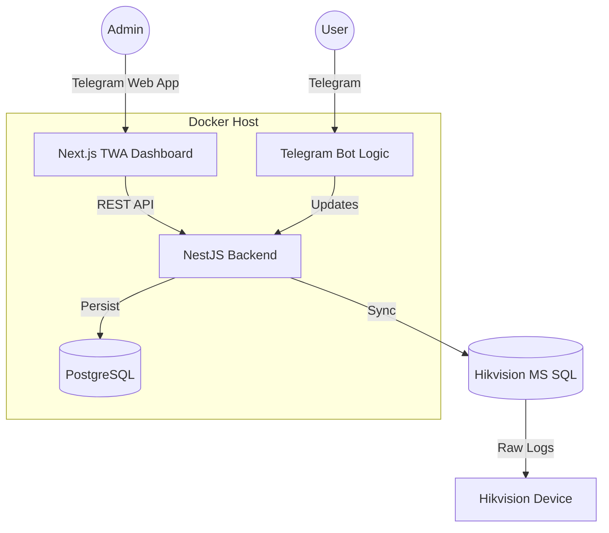

# HR-Monitor System

**HR-Monitor** is a comprehensive attendance tracking system that integrates:
1.  **Hikvision Devices**: Syncs raw attendance logs via MS SQL.
2.  **Telegram Bot**: Employee interaction (Registration, Lateness Reasons, Notifications).
3.  **Telegram Web App (TWA) Dashboard**: Real-time admin dashboard for attendance stats.

## Architecture



## Setup & Deployment

1.  **Clone the Repository**
    ```bash
    git clone <repo-url>
    cd hr-monitor
    ```

2.  **Environment Variables**
    Create a `.env` file in the root directory:
    ```env
    # Database
    DATABASE_URL="postgresql://postgres:postgres@db:5432/hr_monitor?schema=public"
    POSTGRES_USER=postgres
    POSTGRES_PASSWORD=postgres
    POSTGRES_DB=hr_monitor

    # Telegram
    TELEGRAM_BOT_TOKEN=8430489039:AAEFeIJmXU634qd9qZuZ7Q_JuY0S9w9UGNI
    MANAGEMENT_GROUP_ID="-100123456789"

    # Hikvision (MS SQL)
    HIKVISION_HOST="192.168.1.100"
    HIKVISION_PORT=1433
    HIKVISION_USER="sa"
    HIKVISION_PASSWORD="your-password"

    # Frontend
    FRONTEND_URL="http://localhost:3001"
    ```

3.  **Run with Docker Compose**
    ```bash
    docker-compose up -d --build
    ```
    - **Backend**: `http://localhost:3000`
    - **Dashboard**: `http://localhost:3001`

4.  **Logging**
    - Application logs are mapped to `./logs/` on the host machine.
    - Errors are captured by the `AllExceptionsFilter` and saved to `logs/error.log`.

## Troubleshooting

### Hikvision Connection Issues
If the synchronization with Hikvision fails (`ETIMEOUT` or `ECONNREFUSED`):
1.  **Check Network**: Ensure the Docker container can reach the MS SQL server IP.
    ```bash
    docker-compose exec backend ping <HIKVISION_HOST>
    ```
2.  **TCP/IP Enabled**: Verify specific TCP/IP protocols are enabled in the SQL Server Configuration Manager on the Windows host machine.
3.  **Firewall**: Ensure port 1433 is open on the Hikvision server firewall.
4.  **Credentials**: Double-check `HIKVISION_USER` and `HIKVISION_PASSWORD`. Note that some older SQL Servers require significantly weaker/legacy authentication protocols which `mssql` client handles, but verify network security.

## Usage
- **Bot**: Users start the bot, share contact to register.
- **Dashboard**: Admins open the Telegram Web App to view daily stats.
# HR_Monitor
